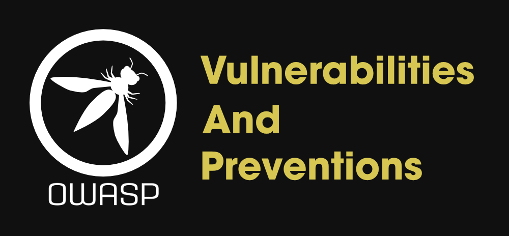
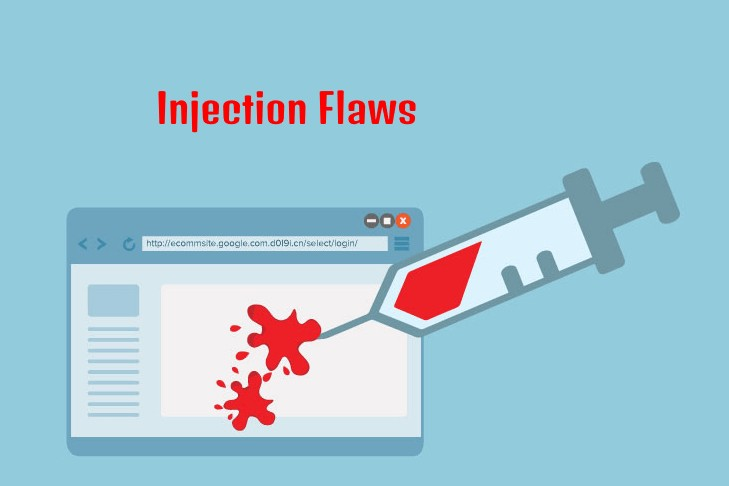

# owasp top 10

# Introduction:
## owasp is abbreviation of open web application security project it's an organization with the goal to help owners and companies of cyber crimes and cyber attacks and apply security solutions to several web appliactions. 
## The owasp top 10 is a standard present the top 10 web application risks for developers to protect their web application against comman attacks used by hackers.
# injection Flaws :

# Description:
## An injection flow is vulnerabilty which allow attacker to send data as a query for  accessing unauthorized data or execute operating system commands on a target machine.
# examples:
## os injection : it happen when user input passed to system commands so hacker can run any system commands on the application servers.
## sql injection: is one of the most common web hacking techniques it happen when user asked for input the user enter a sql statment which manage the attacker to access to the databases and control it.

